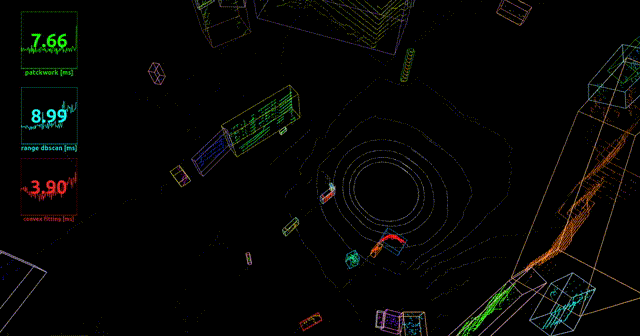

## Convex hull based bounding box fitting for 3D LiDAR Point Clouds
An ROS implementation of convex hull based bounding box fitting for 3D LiDAR point clouds

## Reference
* --

## Features
* very fast comparing to the optimization-based L-shape fitting algorithm

**TODOs**
* imporove the stability

**Known Issues**
* the fitting may be invalid if there are very few point clouds.

## Environment
* Ubuntu 18.04
* ROS melodic

## Dependencies
* ground cloud filter: https://github.com/HMX2013/patchwork-VLP16
* non-ground cloud clustering: https://github.com/HMX2013/Range-image-based-DBSCAN-for-3D-LiDAR-ROS
* sudo apt-get install ros-melodic-autoware-msgs

## rosbag data
https://github.com/TixiaoShan/Stevens-VLP16-Dataset

## How to use
    # clone the repo
    mkdir -p catkin_ws/src
    cd catkin_ws/src
    git clone ...
    cd ../
    catkin_make 
    roslaunch convex_optimize_fitting run.launch

## Contribution
You are welcome contributing to the package by opening a pull-request

We are following: 
[Google C++ Style Guide](https://google.github.io/styleguide/cppguide.html), 
[C++ Core Guidelines](https://isocpp.github.io/CppCoreGuidelines/CppCoreGuidelines#main), 
and [ROS C++ Style Guide](http://wiki.ros.org/CppStyleGuide)

## License
MIT License
